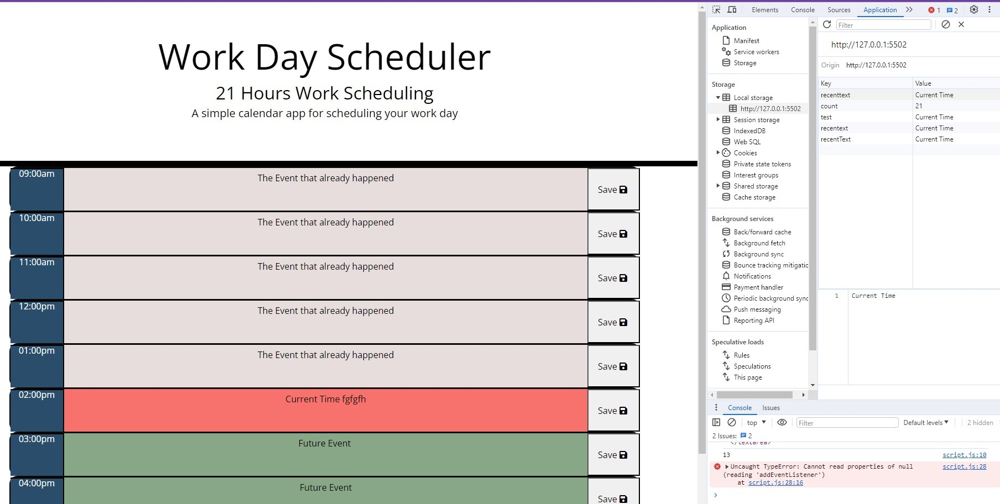

## Tiyle:
 

# Third-Party APIs: Work Day Scheduler

## images:
## 1.A screenshot with console: 

## Acceptance Criteria

The app should:

- Display the current day at the top of the calender when a user opens the planner.
 
- Present timeblocks for standard business hours when the user scrolls down.
 
- Color-code each timeblock based on past, present, and future when the timeblock is viewed.
 
- Allow a user to enter an event when they click a timeblock

- Save the event in local storage when the save button is clicked in that timeblock.

- Persist events between refreshes of a page

## Credits: 
- https://bootcampspot.instructure.com/courses/5076 
- https://www.freecodecamp.org/news/how-to-write-a-good-readme-file/ 
- https://www.markdownguide.org/cheat-sheet 
- BCS-LA-Tyler-Alexander. 
- https://fontawesome.com/search

 
 

## Technologies Used: 

- **HTML5** 
- **CSS3** 
- **JAVASCRIPT** 
 
 

